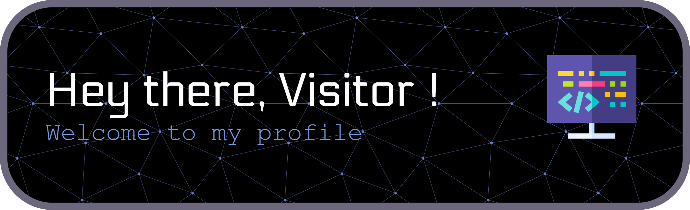

# 
 _Adwait Asagekar over here_ &nbsp; 

 

# ℹ️ About me

I’m a 'Web Developer' with a Master’s degree in Computer Applications (MCA) from VJTI, Maharashtra, India — driven by curiosity and interest for building apps that solve everyday real-world problems. I enjoy learning different layers of technology, working my way around the concepts and upcoming trends. Lately, I've been exploring the AI/ML (Artificial Intelligence / Machine Learning) and data side of things to understand the data science domain.

### What I’m Currently Into -

- Working primarily with Java (Spring) and Python (Django/Flask/FastAPI) to build reliable and scalable systems.
  
- Using React and TypeScript as part of my journey into full-stack development, while also familiarizing with MERN/MEAN stacks.
  
- Exploring data-driven insights using Python, Excel, SQL, and Tableau, and practicing hands-on case studies.
  
- Learning how AI/ML models are built and trained using Scikit-learn, TensorFlow/Keras, NumPy, and pandas, while experimenting on Kaggle.

### My Core Interests -

- Collaborate and contribute to open-source projects.
  
- Demonstrate knowledge and skills in hackathons, coding contests or Kaggle competitions.

- Engage and learn something new with the developer and data communities.
  
 

# 🛠️ Technical Expertise

 

  | **Skills** | **Tools & Tech** |
  | :-------: | :------ |
  | Coding Languages |      |
  | Backend Development |      |
  | Frontend Design |    |
  | Database Management & ORMs |    |
  | Cloud Computing Services | Row 2 Col 2 |
  | Development Environments |     |
  | Version Control | Row 2 Col 2 |
  
<!--
**adwaitDev/adwaitDev** is a ✨ _special_ ✨ repository because its `README.md` (this file) appears on your GitHub profile.

Here are some ideas to get you started:

- 🔭 I’m currently working on ...
- 🌱 I’m currently learning ...
- 👯 I’m looking to collaborate on ...
- 🤔 I’m looking for help with ...
- 💬 Ask me about ...
- 📫 How to reach me: ...
- 😄 Pronouns: ...
- ⚡ Fun fact: ...
-->
